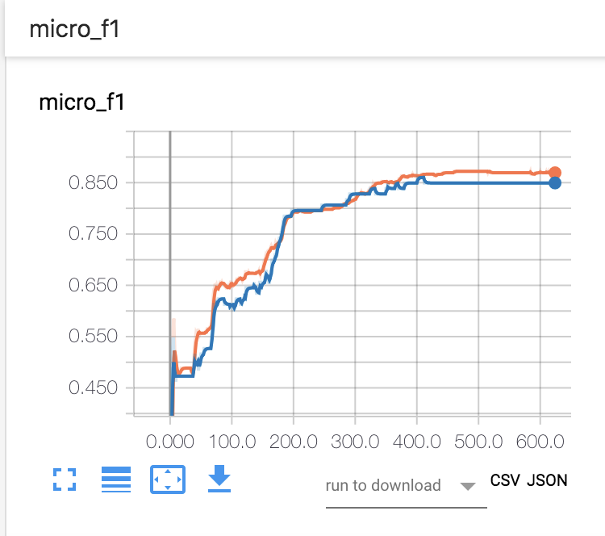

# GAT modified
Graph Attention Networks (Veličković *et al.*, ICLR 2018): [https://arxiv.org/abs/1710.10903](https://arxiv.org/abs/1710.10903)



## Overview
Here we provide the implementation of a Graph Attention Network (GAT) layer in TensorFlow, along with a minimal execution example (on the Cora dataset). The repository is organised as follows:
- `data/` contains the necessary dataset files for Cora;
- `models/` contains the implementation of the GAT network (`gat.py`);
- `pre_trained/` contains a pre-trained Cora model (achieving 84.4% accuracy on the test set);
- `utils/` contains:
    * an implementation of an attention head, along with an experimental sparse version (`layers.py`);
    * preprocessing subroutines (`process.py`);
    * preprocessing utilities for the PPI benchmark (`process_ppi.py`).


## Sparse version
An experimental sparse version is also available, working only when the batch size is equal to 1.
The sparse model may be found at `models/sp_gat.py`.

You may execute a full training run of the sparse model on Cora through `execute.py`.

## Command line argument
```
optional arguments:
  -h, --help            show this help message and exit
  -s, --sparse          use sparse operation to reduce memory consumption
  --epochs EPOCHS       number of epochs
  --lr LR               learning rate
  --patience PATIENCE   for early stopping
  --l2_coef L2_COEF     l2 regularization coefficient
  --hid_units HID_UNITS [HID_UNITS ...]
                        numbers of hidden units per each attention head in
                        each layer
  --n_heads N_HEADS [N_HEADS ...]
                        number of attention head
  --residual            use residual connections
  --attention_drop ATTENTION_DROP
                        dropout probability for attention layer
  --edge_attr_directory EDGE_ATTR_DIRECTORY
                        directory storing all edge attribute (.npz file) which
                        stores the sparse adjacency matrix
  --node_features_path NODE_FEATURES_PATH
                        csv file path for the node features
  --label_path LABEL_PATH
                        csv file path for the ground truth label
  --log_directory LOG_DIRECTORY
                        directory for logging to tensorboard
  --train_ratio TRAIN_RATIO
                        ratio of data used for training (the rest will be used
                        for testing)
```

## example (train)

```bash
$ git clone 

$ cd data

$ curl https://transfer.sh/11fhgc/eth.tar.gz -o eth.tar.gz

$ tar -zxcf eth.tar.gz

$ cd ../

$ python execute.py \
--sparse \
--epochs 100000 \
--lr 0.008 \
--patience 50 \
--l2_coef 0.005 \
--hid_units 5 \
--n_heads 2 1 \
--residual \
--attention_drop 0.0 \
--edge_attr ./data/eth/edges \
--node_features_path ./data/eth/node_features.csv \
--log_directory /tmp/tensorboard \
--label_path ./data/eth/label.csv

$ tensorboard --logdir=/tmp/tensorboard  # to run tensorboard
```
Once TensorBoard is running, navigate your web browser to localhost:6006 to view the TensorBoard

## example (load model)

``` bash
$ curl https://transfer.sh/iMacq/pre_trained.tar.gz -o pre_trained.tar.gz

$ tar -zxcf pre_trained.tar.gz

$ python load_model.py \
--sparse \
--hid_units 5 \
--n_heads 2 1 \
--residual \
--edge_attr /home/handason/data/eth/edges \
--node_features_path /home/handason/data/eth/node_features.csv \
--label_path /home/handason/data/eth/label.csv \
--train_ratio 0.8 \
--model_path ./pre_trained/mod_test.ckpt

$ # should print: Test loss: 0.579380989074707 ; Test accuracy: 0.86021488904953

```

## Dependencies

The script has been tested running under Python 3.5.2, with the following packages installed (along with their dependencies):

- `numpy==1.14.1`
- `scipy==1.0.0`
- `networkx==2.1`
- `tensorflow-gpu==1.6.0`
- `pandas==0.23.4`

In addition, CUDA 9.0 and cuDNN 7 have been used.

## Reference
If you make advantage of the GAT model in your research, please cite the following in your manuscript:

```
@article{
  velickovic2018graph,
  title="{Graph Attention Networks}",
  author={Veli{\v{c}}kovi{\'{c}}, Petar and Cucurull, Guillem and Casanova, Arantxa and Romero, Adriana and Li{\`{o}}, Pietro and Bengio, Yoshua},
  journal={International Conference on Learning Representations},
  year={2018},
  url={https://openreview.net/forum?id=rJXMpikCZ},
  note={accepted as poster},
}
```

## License
MIT
=======
